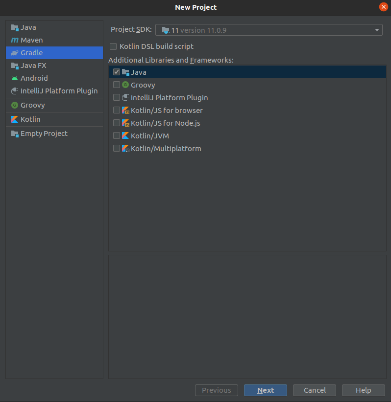
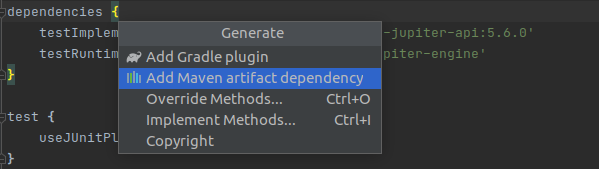
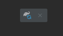

This repo is a simple introduction to using some of the java json parsing library, *jackson*.

# What I learned in this tutorial

* Intellij IDE
* Gradle
* Jackson

# Setting up Gradle

1. Open intellij.

2. Start a new project.

* You are able to choose any version of the JDK that is availible on your machine.
* You can also download new versions of the JDK.
* `Java` is our only aditional library. We can add more later.

3. Select your project directory and give your project a name.

4. The project should automatically build. If the project doesn't automatically build, do it manually.

5. Lets add a main class under the `main/java/` sub directory.

6. Run the code. It should work.

7. Lets add the jackson dependancy to Gradle.

* open `build.gradle`.
* (if on linux) go to the dependancies section and press `alt+insert`. To add a dependancy.

* Now you should be able to find your required dependacy or version.
    * If this cmd doesn't work, dependancies should auto complete. If all else fails just look on stack overflow

8. Refresh dependacies.

* You should be able to see an icon like this  
  
in the top right of your code view. Click it to refresh the new dependancies.
    * I'm not surewhat to do if this icon doesn't show up.

This should have you all set to use *jackson*. Try follow olong in the code to understand jackson.